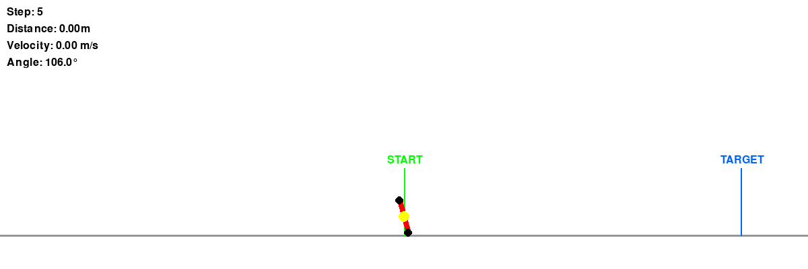

# Stick Rotation - Genetic Algorithm Training



A reinforcement learning project where a stick learns to walk using a genetic algorithm. The agent controls a stick that must rotate and move forward to reach a target distance, using physics-based simulation and neural network control.

## Overview

This project implements a stick walker environment where a neural network agent learns to control a rotating stick to move forward. The training uses a genetic algorithm (GA) approach rather than traditional gradient-based methods, making it an interesting alternative to policy gradient or Q-learning methods.

### Key Features

- **Physics-based simulation**: Realistic 2D physics with gravity, friction, and collision detection
- **Genetic Algorithm training**: Population-based optimization with selection, crossover, and mutation
- **Neural Network control**: Feedforward network with configurable architecture
- **Visualization**: Real-time rendering with pygame and GIF generation
- **TensorBoard logging**: Track training progress and metrics

## Environment Details

The stick walker environment consists of:
- **Action space**: 3 discrete actions (rotate left, do nothing, rotate right)
- **Observation space**: 6 continuous values (angle, angular velocity, x, y, vx, vy)
- **Goal**: Move the stick forward to reach a target distance of 10 meters
- **Reward**: Forward movement minus a small step penalty to encourage efficiency

## Installation

### Requirements

- Python 3.7+
- pygame
- numpy
- torch (for TensorBoard logging)
- imageio (for GIF generation)

### Setup

```bash
# Clone the repository
git clone <repository-url>
cd StickRotation

# Install dependencies
pip install pygame numpy torch tensorboard imageio
```

## Usage

### Training

Train a new model using the genetic algorithm:

```bash
python train_ga.py
```

Training parameters can be adjusted in `train_ga.py`:
- `POPULATION_SIZE`: Number of networks in each generation (default: 50)
- `GENERATIONS`: Number of training generations (default: 100)
- `ELITE_SIZE`: Number of top performers to keep (default: 5)
- `MUTATION_RATE`: Probability of mutating each weight (default: 0.1)
- `MUTATION_STRENGTH`: Strength of mutations (default: 0.3)
- `CROSSOVER_RATE`: Probability of crossover between parents (default: 0.7)

Training progress is logged to TensorBoard. View it with:

```bash
tensorboard --logdir runs
```

### Evaluation

Evaluate the trained model:

```bash
python train_ga.py eval
```

Or evaluate a specific model:

```bash
python train_ga.py eval models_ga/model_ga.pkl
```

### Visualization

View the trained model in action:

```bash
python showModel_ga.py
```

Controls:
- **R**: Reset episode
- **Q**: Quit

### Generate GIF

Create a GIF demonstration of the trained agent:

```bash
python generate_gif.py
```

Or specify a custom output path:

```bash
python generate_gif.py output.gif
```

### Manual Control

Try controlling the stick manually:

```bash
python render.py
```

Controls:
- **A**: Rotate left
- **D**: Rotate right
- **SPACE**: Do nothing
- **R**: Reset
- **Q**: Quit

## Project Structure

```
StickRotation/
├── env.py              # Stick walker environment implementation
├── network.py          # Neural network class
├── render.py           # Visualization and manual control
├── train_ga.py         # Genetic algorithm training script
├── showModel_ga.py     # Display trained model performance
├── generate_gif.py     # Generate GIF demonstrations
├── models_ga/          # Saved model directory
│   └── model_ga.pkl   # Trained model (pickle format)
├── runs/               # TensorBoard log directory
└── README.md           # This file
```

## Technical Details

### Neural Network Architecture

- **Input layer**: 6 neurons (normalized observations)
- **Hidden layers**: 2 layers with 32 neurons each
- **Output layer**: 3 neurons (action logits)
- **Activation**: tanh for hidden layers, argmax for action selection

### Genetic Algorithm

The training process follows these steps:

1. **Initialization**: Create a population of random neural networks
2. **Evaluation**: Test each network over multiple episodes and compute fitness (reward)
3. **Selection**: Use tournament selection to choose parents
4. **Crossover**: Create offspring by combining parent weights (uniform crossover)
5. **Mutation**: Add Gaussian noise to random weights
6. **Elitism**: Keep the best performers in the next generation
7. **Repeat**: Continue for specified number of generations

### Physics Simulation

The environment simulates:
- Rotational dynamics with moment of inertia
- Linear motion with gravity
- Ground collision detection and response
- Friction forces at contact points
- Bounce effects with configurable restitution

## Results

The trained model learns to:
- Rotate the stick to generate forward momentum
- Balance and control the stick's motion
- Efficiently move toward the target distance
- Handle physics interactions and collisions

Training metrics (distance, steps, reward) are logged to TensorBoard for analysis.

## License

[Add your license here]

## Contributing

Contributions are welcome! Feel free to open issues or submit pull requests.

## Acknowledgments

This project demonstrates genetic algorithms as an alternative to gradient-based reinforcement learning methods, showing that evolutionary approaches can successfully train neural network controllers for physics-based tasks.

